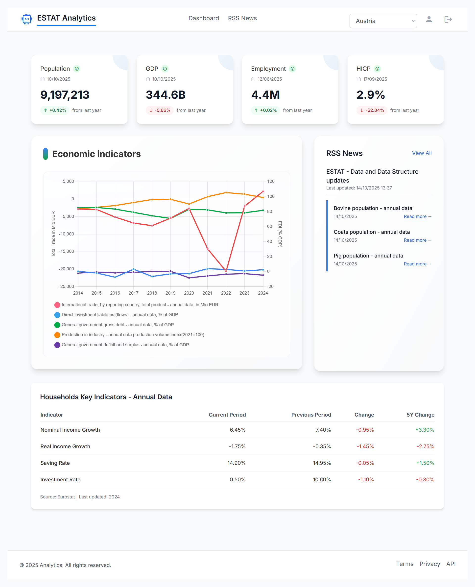
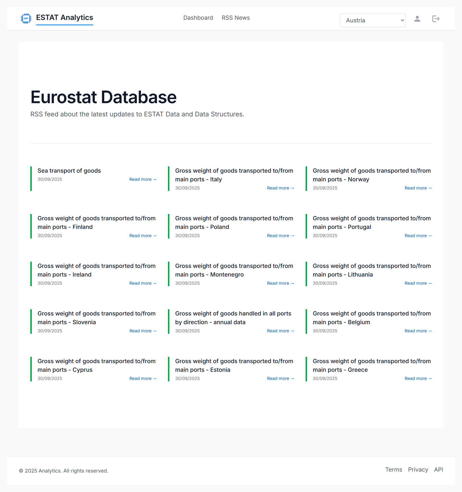
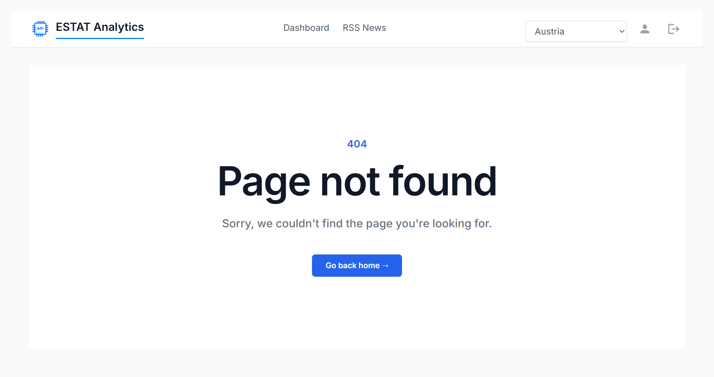

# STAT-DATA-VIEW

A dynamic tool for visualizing statistical data with Chart.js, powered by the Eurostat API. It provides interactive charts for economic indicators, with robust data processing and a clean, maintainable architecture.

**Demo Site**: [View Live Application](https://stat-data-view.netlify.app/dashboard)



## Table of Contents

- [Features](#features)
- [Application Preview](#application-preview)
- [Technology Stack](#technology-stack)
- [Technical Implementation Overview](#technical-implementation-overview)
- [Installation](#installation)
- [Development](#development)
- [Project Architecture](#project-architecture)
- [API Documentation](#api-documentation)
- [Testing](#testing)
- [Deployment](#deployment)
- [License](#license)

## Features

<details>
<summary>Click to expand</summary>

### Data Visualization
- Multi-axis and interactive charts  
- Real-time statistical data from **Eurostat API**

### Data Processing
- API parameter handling, mapping layer, and data normalization  

### Global Error Handling
- Centralized system with smart interception  
- User-friendly notifications via **ngx-toastr**  

### RSS Feed Integration
- Real-time news updates (XML → JSON)  
- Reactive streams with RxJS, client-side pagination, search filtering  
  
 </details>
  

## Technology Stack

<details>
<summary>Click to expand</summary>

### Frontend
- Angular, TypeScript, Angular Material, Chart.js (ng2-charts), RxJS  
- Tailwind CSS for styling, NGX Pagination, NGX-Toastr  

### Development Tools
- Angular CLI, npm, Jasmine & Karma, PostCSS + Autoprefixer  

### External APIs
- Eurostat REST API for statistical data  
- RSS feeds for news integration  

</details>

## Technical Implementation Overview

<details open>
<summary>Click to expand</summary>


| **Technical Implementation Component** | **Implementation Details**                                                        |
| -------------------------------------- | --------------------------------------------------------------------------------- |
| **Frontend Framework**               | **Angular** – modular, scalable architecture with lazy-loaded feature modules     |
| **Language**                         | **TypeScript** – full type safety, interfaces, and modern ES features             |
| **UI Library**                       | **Angular Material** – consistent design system and responsive components         |
| **Charting Library**                 | **Chart.js** (via ng2-charts) – interactive and multi-axis visualizations         |
| **State Management**                 | **RxJS** – reactive streams for handling data flow and component updates          |
| **Styling**                          | **Tailwind CSS** + PostCSS + Autoprefixer for utility-first styling               |
| **Data Source**                      | **Eurostat REST API** – real-time economic and statistical data integration       |
| **RSS Integration**                  | **fast-xml-parser** converts XML → JSON, updated dynamically via RxJS observables |
| **Error Handling**                   | Centralized system: `Interceptor → ErrorHandlingService → AppComponent → Toastr`  |
| **Notification System**              | **NGX-Toastr** – non-intrusive toast notifications for user feedback              |
| **Routing & Navigation**             | **Angular Router** with lazy loading for optimized navigation                     |
| **Pagination**                       | **NGX Pagination** – efficient client-side paging for large datasets              |
| **Data Transformation**              | Custom mapping layer converts Eurostat responses into Chart.js-friendly format    |
| **Testing Framework**                | **Jasmine & Karma** – unit testing with detailed coverage reports                 |
| **Development Tools**                | **Angular CLI** & **npm** for build automation and dependency management          |
| **Proxy Middleware**                 | Angular proxy (`proxy.conf.json`) for local API request routing                   |
| **Architecture Style**               | Clean modular structure: Core, Features, Shared modules                           |
| **Deployment Platform**              | **Netlify** – CI/CD and static hosting for production builds                      |
| **Error Prevention & Stability**     | Smart HTTP interception, consistent error formatting, and fallback mechanisms     |
| **Code Organization**                | Structured by functionality: `core/`, `features/`, `shared/`, `interfaces/`       |
| **API Documentation**                | Based on **Eurostat REST API** official guide                                     |
| **Version Control**                  | **Git (GitHub)** – collaborative version management                               |

</details>


## Application Preview

<details>
<summary>Click to view screenshots</summary>


_Dashboard with statistical data visualization_


_RSS news feed integration_


_Custom 404 error page_

</details>

## Installation

<details>
<summary>Click to expand</summary>

1. **Clone the repository**

```bash
git clone https://github.com/yourusername/stat-data-view.git
cd stat-data-view
```

2. **Install dependencies**

```bash
cd client
npm install
```

</details>

## Development

<details>
<summary>Click to expand</summary>

### Running the Development Server

From the project root:

```bash
npm start
```

This will start the Angular development server at `http://localhost:4200`

The application will automatically reload if you change any of the source files.

### API Proxy Configuration

All API requests from the frontend are automatically proxied through the Angular proxy configuration (`proxy.conf.json`).

**Example:**

```typescript
// In your Angular service
const response = await this.http.get("/api/rss-news");
```

This request is automatically forwarded to:

```
http://localhost:4200/api/rss-news
```

</details>

## Project Architecture

<details>
<summary>Click to expand</summary>

### High-Level Overview

The application follows Angular's best practices with a clear modular structure:

```
STAT-Data-View/
├── client/
│   └── src/
│       ├── app/
│       │   ├── core/          # Singleton services, guards
│       │   ├── features/      # Feature modules (lazy-loaded)
│       │   ├── shared/        # Reusable components
│       │   ├── interfaces/    # TypeScript interfaces
│       │   └── layout/        # Layout components
│       ├── assets/            # Static assets
│       └── environments/      # Environment configurations
```

### Module Structure

```
App Module
├── Core Module (singleton)
│   ├── Header
│   ├── Footer
│   ├── Page Not Found
│   ├── Config
│   ├── Interceptors
│   └── Services
├── Features Module
│   └── Source Data Module
│       ├── Chart
│       ├── Dashboard
│       ├── Data Table
│       ├── Metric Card
│       └── RSS News List
└── Shared Module
    ├── Custom Button
    ├── Pagination
    ├── Pipes
    ├── Recent Updates
    ├── RSS News
    ├── Select Menu
    ├── Sidebar
    ├── Search Box
    └── Utilities
```

### Data Flow

```
┌─────────────────────────────────────────────────┐
│              App Component                      │
└──────────────────┬──────────────────────────────┘
                   │
        ┌──────────┼──────────┐
        │          │          │
   ┌────▼───┐ ┌───▼────┐ ┌──▼─────┐
   │  Core  │ │Features│ │ Shared │
   │ Module │ │ Module │ │ Module │
   └────┬───┘ └───┬────┘ └──┬─────┘
        │         │          │
        │    ┌────▼─────┐    │
        │    │  Source  │    │
        │    │   Data   │◄───┤
        │    │  Module  │    │
        │    └────┬─────┘    │
        │         │          │
   ┌────▼─────────▼──────────▼────┐
   │        API Service            │
   └───────────────────────────────┘
```

### Architecture Principles

✅ **Modular Structure** - Clear separation of concerns  
✅ **Lazy Loading** - Feature modules loaded on demand  
✅ **Shared Components** - Reusable UI components  
✅ **Type Safety** - Full TypeScript coverage  
✅ **Reactive Programming** - RxJS for state management  
✅ **Clean Architecture** - Domain-driven design principles

</details>

## API Documentation

<details>
<summary>Click to expand</summary>

### Eurostat REST API

The application uses the EUROSTAT REST API for statistical data.

**Documentation:** [API Getting Started Guide](https://ec.europa.eu/eurostat/web/user-guides/data-browser/api-data-access/api-getting-started)

</details>

## Testing

<details>
<summary>Click to expand</summary>

### Unit Tests

Run unit tests with Karma:

```bash
npm test
```

### Code Coverage

Generate coverage report:

```bash
ng test --no-watch --code-coverage
```

Coverage reports are generated in `coverage/` directory.

**Test coverage:** **~70%** (detailed reports in coverage/ directory)

</details>

## Deployment

<details>
<summary>Click to expand</summary>

### Production Build

```bash
npm run build
```

### Deployment Options

#### Netlify (Current)

The application is deployed on Netlify: [stat-data-view.netlify.app](https://stat-data-view.netlify.app/dashboard)

</details>


## License

<details>
<summary>Click to expand</summary>
  
This work is licensed under the **Creative Commons Attribution-NonCommercial 4.0 International License**.

### You may:

- ✅ **Share** - Copy and redistribute the material in any medium or format
- ✅ **Adapt** - Remix, transform, and build upon the material

### Under the following terms:

- **Attribution** - You must give appropriate credit, provide a link to the license, and indicate if changes were made
- **NonCommercial** - You may not use the material for commercial purposes

No additional restrictions - You may not apply legal terms or technological measures that legally restrict others from doing anything the license permits.

For full license text, visit: [https://creativecommons.org/licenses/by-nc/4.0/](https://creativecommons.org/licenses/by-nc/4.0/)

---

**Made with ❤️ by Zlatozara Zlatkova**

_Last updated: September 2025_

</details>
