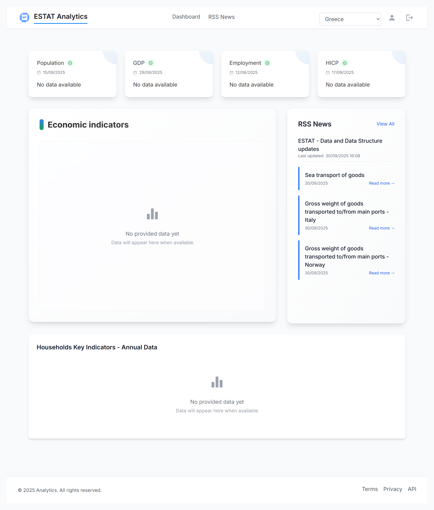

# STAT-DATA-VIEW

<details open>
<summary><p>Note: Click to expand / collapse Documentation section</p></summary>
</details>

<details open>
<summary><h3>1. Project Overview</h3></summary>

<details open>
<summary><h4>1.1. Brief Description</h4></summary>

Visualization of statistical data using Chart.js with Eurostat API integration.  
The project aims to provide dynamic and interactive charts for economic indicators, with a strong focus on reliable data transformation and clean, maintainable code structure.

### Key Features

- **Improve API parameter handling**  
  Enhanced processing of input parameters for Eurostat API requests to ensure accurate data retrieval based on selected indicators and time periods.

- **Implement mapping layer for API responses**  
  Introduced a mapping layer that converts Eurostat API responses into an internal format optimized for Chart.js visualizations.

- **Develop robust data transformation pipeline**  
  Built a reliable pipeline for data transformation, including normalization, handling of missing values, and adaptation to different units and formats.

- **Create multi-axis chart with separate scales**  
  Added support for multi-axis charts that allow visualization of different economic indicators with separate scales (e.g., percentages vs. absolute values) on a single diagram.

- **RSS Feed Integration**  
  This implementation integrates an RSS feed into the application by converting XML data into JSON and exposing it through reactive streams.  
  It keeps the news items up to date with RxJS, allows easy filtering or limiting to the latest entries, and ensures smooth navigation to both internal pages and external article links.

### Application Preview




</details>
</details>

<details open>
<summary><h3>2. Project Architecture</h3></summary>

Explanation of system design and components.

</details>


<details open>
<summary><h3>3. API Documentation</h3></summary>

The EUROSTAT REST API is publicly available. Documentation and usage instructions can be found here: [API Getting Started](https://ec.europa.eu/eurostat/web/user-guides/data-browser/api-data-access/api-getting-started)


</details>


<details open>
<summary><h3>4. Environment Setup</h3></summary>

<details open>
<summary><h4>4.1. Build Setup</h4></summary>

1. Install dependencies for client: 
     ```
     cd client
     npm install
     ```

2. Run client-side from the project root:  
   ```
   npm start
   ```
  
   This will start:  
   - Frontend (Angular) server at `http://localhost:4200`


- **Note about API Proxy:**  
  All API requests from the frontend are automatically proxied to the backend server through the Angular proxy configuration (`proxy.conf.json`). Here's how it works:

  - In your Angular services, you can make API calls using shorter paths:  
    ```
    const response = await this.http.get('/api/rss-news');
    ```

  - The Angular proxy automatically forwards these requests to your backend server:  
    ```
    http://localhost:4200/api/rss-news
    ```

</details>
</details>

<details>
<summary><h3>5. Security Measures</h3></summary>

Details on security policies and best practices.

</details>


<details>
<summary><h3>6. Error Handling</h3></summary>

Error codes, logs, and troubleshooting tips.

</details>

<details>
<summary><h3>7. References and Resources Used</h3></summary>

List of references, tools, and external resources.

</details>
